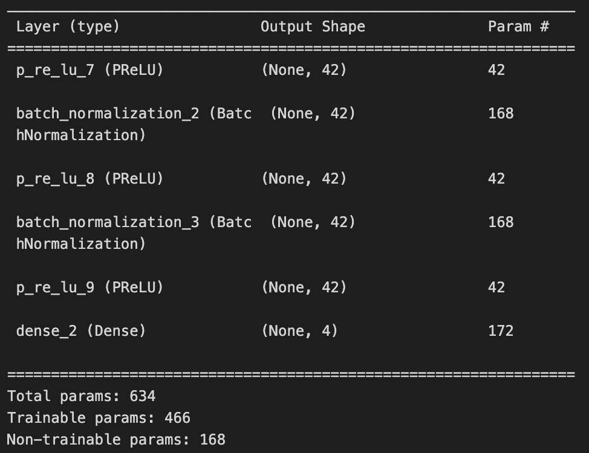
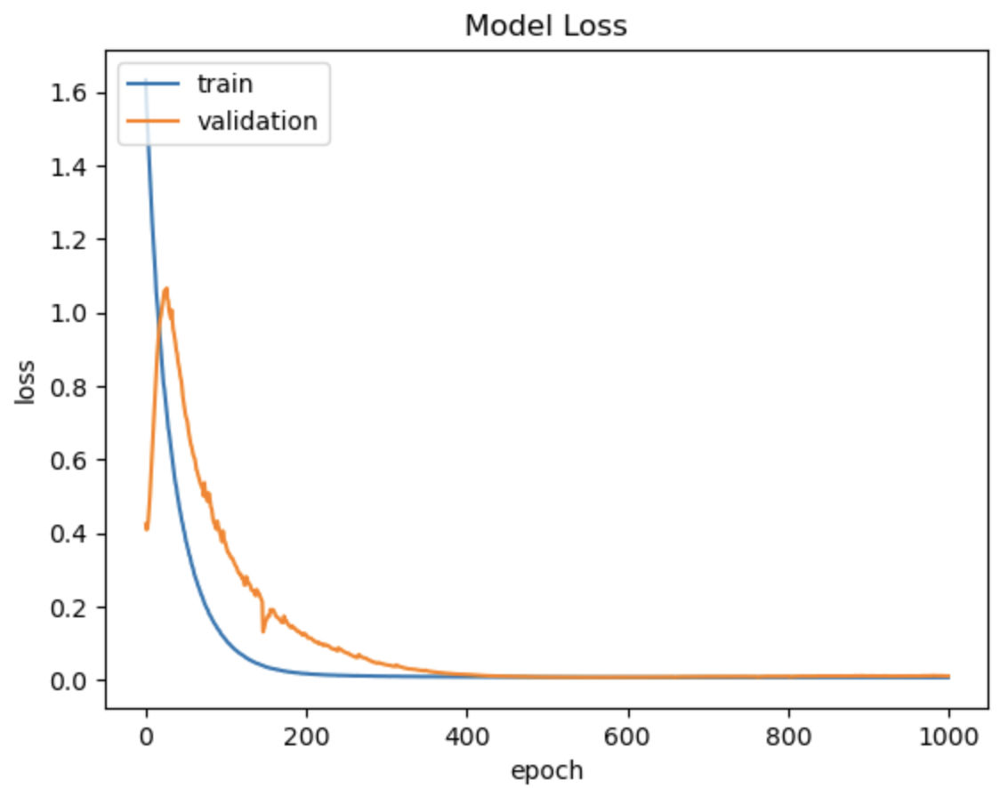
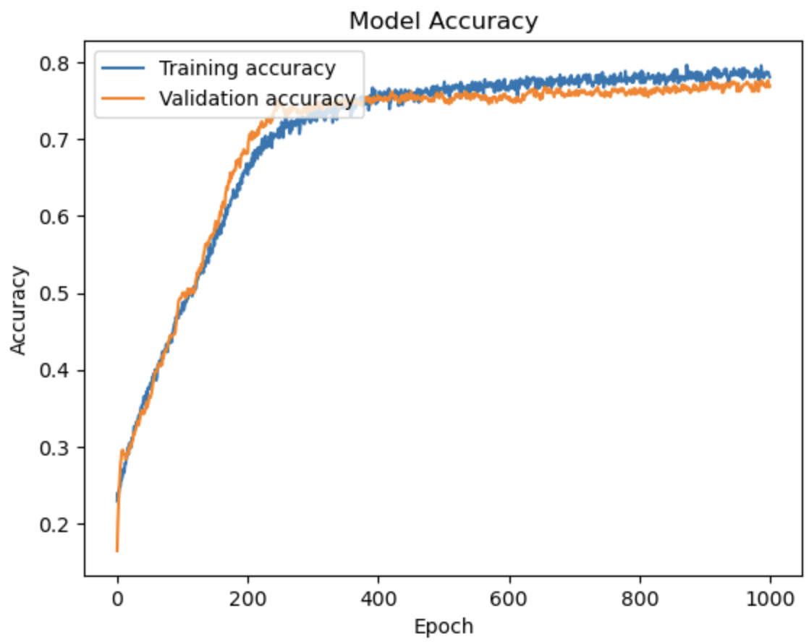

# MTA Schedule Deviation
## Introduction
The New York City subway system is the least reliable rapid transit system in the world, in terms of arriving and departing on schedule.  Only around 75% of trains are on schedule, compared to a global average of 90%.  The MTA credits aged infrastructure for schedule deviation, but there are other operational factors to consider.  Using OpenData’s MTA portal, data pertaining to ridership, delay-causing incidents, and schedule reliability performance was examined to find leading causes of train delays, and to predict the number of additional customer wait time (both on-platform and on-train) and trips delayed by 5 minutes or more.  Finding  improvements may also help to find redundancy and cut costs.

## Parametric ReLU
Parametric ReLU is a variant of the ReLU activation function that allows for non-zero output of negative inputs, shown below.
As the network propagates, α is another parameter learned by the network, and is updated in cascading hidden layers.  It is initialized to a small value (typically <0.1); α of 0 is functionally equivalent to a regular ReLU, and a fixed α is Leaky ReLU.  PReLU increases accuracy and solves the dying neuron problem of ReLU, similar to Leaky ReLU, with a tradeoff of increased model computation cost.  Since no layer outputs 0, network sparsity is greatly decreased. He et al. (2015) created PReLU when developing an ImageNet classification model.   The Keras PReLU layer has 3 parameters for α; initializer, regularizer, and constraint.  The researchers initialized α to 0.25, and testing concluded that there is no significant difference in changing the initialization to any small non-zero value.  The regularizer applies penalties to outlying weights to regulate weight swings, and includes L1, L2, L1L2, and orthogonal regularizers.  The researchers argue that the regularizer "tends to push [αs] to zero, and thus biases PReLU towards ReLU”, so it was omitted.  Finally, the constraint parameter limits α values (non-negative, bounded, custom), but constraints can make α monotonic.

## Approach
Seven different datasets were combined into a single matrix using inner joins on the month, division, line, period, and day type.  The year, month, division, line, day type, period, number of passengers, category and count of delay-causing incident, number of scheduled trains, number of actual trains, and number of scheduled trips were chosen as the indicating features.  These were used to predict additional platform time, additional on-train time, and number of trips  that arrived 5 minutes past their scheduled arrival.  Data was then split into 70% for training, 15% for validation, and 15% for testing, with random shuffling.
	
The division, line, period, and incident category are categorical features and had to be encoded via OneHotEncoding.  The line feature has 27 distinct values, which raised concerns of high cardinality.  Previous research concluded that features with less than 50 values are considered safe for OneHotEncoding.  Numerical features were scaled using MinMaxScaling with values between 0 and 1.

RandomForestRegressor was then used for EDA feature importance using 100 trees.  Although this is not particularly relevant to the neural network, it determined the single greatest contributor to train delays.  A RandomForestClassifier could have been used to classify trips as on time or late, but regression was chosen for finer granularity.  Concerns of bias towards high-cardinality data could have been alleviated using permutation feature importance instead.

Lastly, a fully connected deep neural network was used for the predictors.  Below is a summary of the network architecture.

Because this is a regression network, the output layer used a linear activation function and MSE was used for the loss function.  Adamax was the preferred optimizer as it adjusts the learning rate and is more suitable for time-series data.  However it is currently not supported on the machine used for training, so Adam was used instead.  The learning rate was fixed to 0.0001, a batch size of 100, and 1000 epochs.

## Results

## Future Work 
Future work includes use of the Adamax optimizer, adding more hidden layers, utilization of the car failure dataset, as well as diversity of line car fleet, use of L1L2 regularization in PReLU and using different activation functions.

